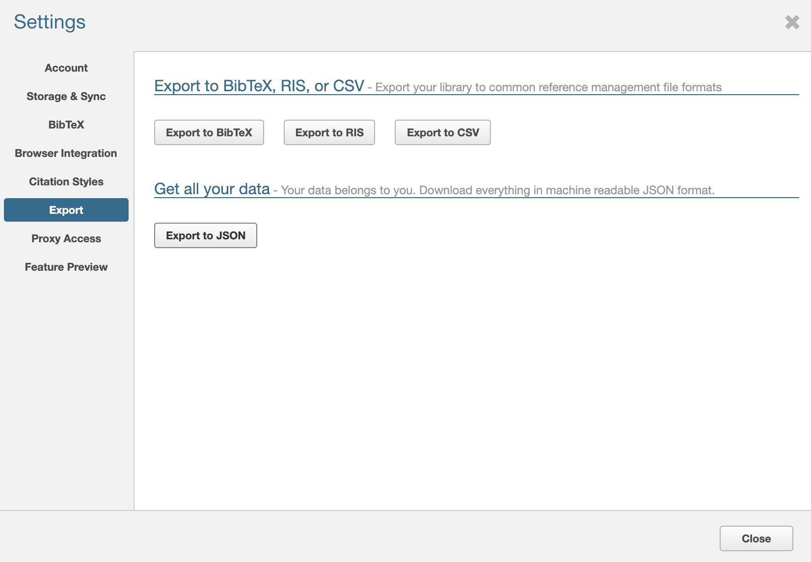
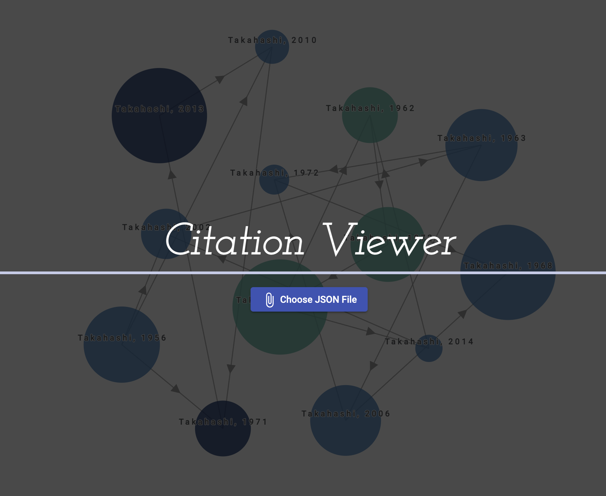
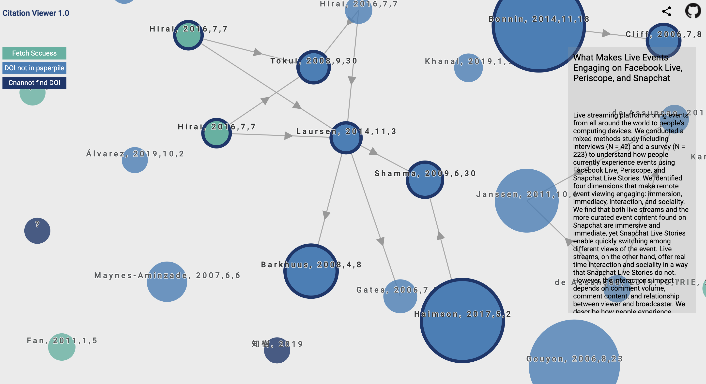

# CitationViewer
https://tatsuya-takahashi.github.io/citation-viewer/

## What's this
This is a visualization of the citation relationships of the papers registered in Paperpile.
It is a graph network where nodes are papers and edges are citation relations.

## Release Note
### 2021.01.06 Ver 1.0
- Published

## Environment
- Windows, Mac OS, Linux, iPad OS
- Google Chrome

## How To Use
1. Export json from Paperpile.  
Paperpile -> Settings -> Export -> Export to JSON



2. Access to [Citation Viewer](https://tatsuya-takahashi.github.io/citation-viewer/) and Upload JSON file
> Since all the processing is done on the your client PC, your JSON file and personal information will not be sent to the server at all.



## Description

- Each node represents a paper registered in your Paperpile, and the edges represent citation relationships. If the arrow head is A -> B, it means that the paper A refers to the paper B. If the arrow head is A -> B, it means that the paper A refers to the paper B.
- The size of the circle expresses the impact factor. Strictly speaking, it is proportional to the number of citations. It does not depend on the papers you have in Paperpile, but on the metadata you get from crossref.
- 'Fetch Success' indicates that the meta information was successfully retrieved from the DOI information registered in Paperpile.
- 'DOI not in paperpile' indicates that the DOI information was not registered in the paperpile, so the meta-information was obtained by identifying the DOI from the title.
- 'Cannot Find DOI' indicates that the DOI is not registered in the paperpile and the DOI could not be identified from the title.

## How to improve your network
- By supplementing the DOI and title information, you will have a better network.

## Bugs or Feature Request
- If you find a bug or have a feature you would like to see added, please submit an Issue. We also accept pull requests.

## How to setup
### Clone this repository
```
git clone https://github.com/tatsuya-takahashi/citation-viewer.git
```

### install library
```
npm install
```

### debug in your local
```
npm run start
```

## Roadmap
- Visualize the tag information in Paperpile
- A system that does not require json uploads in conjunction with Paperpile
- Grouping Function
- Add notes and save network

## Donation
Your donation will encourage the development of the application.
Amazon Gift Cards are accepted from ¥15.  

My Wish List  
https://www.amazon.co.jp/hz/wishlist/ls/LM7BTYTNIHI/ref=nav_wishlist_lists_1?_encoding=UTF8&type=wishlist